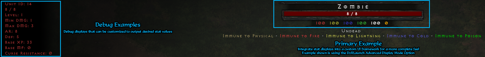

# d2rhud

Similar to https://github.com/Sh0ckFR/Universal-Dear-ImGui-Hook but cleaned up a bit and using [vcpkg](https://github.com/microsoft/vcpkg#quick-start-windows) for dependency management.
- Stat Display code can be edited in plugin/D2RHUD/D2RHUD.cpp
- Font Loading can be edited in D3D12Hook.cpp
- This DLL is also used by [D2RLaunch](https://github.com/locbones/D2RLaunch-WPF) for Advanced Monster Stats Display

Credits to scizzydo for resize logic and [dschu012](https://github.com/dschu012) for D2R base configuration.

